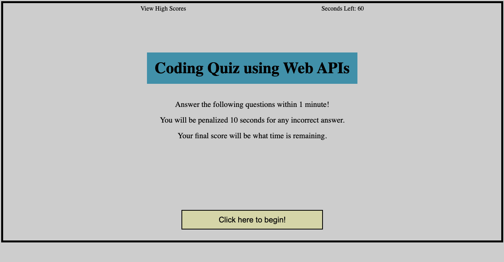
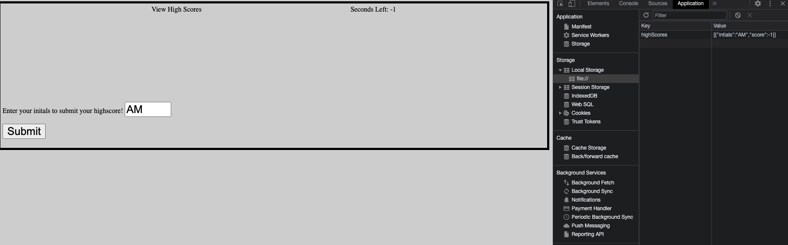

# Code-Quiz

## User Story

My task for this homework is to create a code quiz that is interactive with javascript.  I have to have the timer deduct time if a question is answered wrong.  If the user finishes the quiz before the timer runs out that is their score and they can add their highscore to the list of highscores.

## Acceptance Criteria

GIVEN I am taking a code quiz
WHEN I click the start button
THEN a timer starts and I am presented with a question
WHEN I answer a question
THEN I am presented with another question
WHEN I answer a question incorrectly
THEN time is subtracted from the clock
WHEN all questions are answered or the timer reaches 0
THEN the game is over
WHEN the game is over
THEN I can save my initials and my score

## Github URL
https://mclanea92.github.io/Code-Quiz/

## Screenshots
This screenshot is the start of my code quiz page.  

This screenshot shows that the initals are saved into local storage with the highscore.

